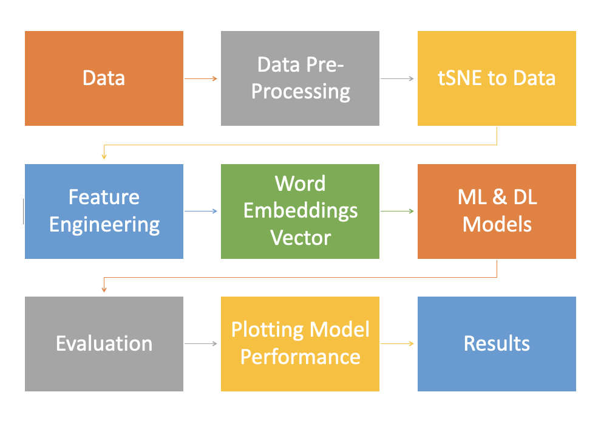

# AI_Final_Project

## Project Overview

Feature Engineerng Techniques:

1. One-hot encoding
2. Tf-Idf Vector
3. Average word2vec

Machine Learning Models:

1. SVM with Linear Kernel
2. SVM with RBF Kernel
3. Multionomial Naive Bayes Classifier

Deep Learning Models:

1. Long Short-Term Memory
2. Bidirectional RNN with GRU

Performance metrics:

1. Multi class log loss
2. Confusion Matrix
